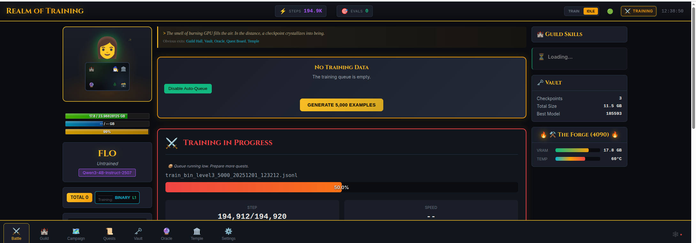

# The Realm of Training

> **Contributing/Forking?** See [`SHARING.md`](SHARING.md) before pushing to public repos.

> *We propose a surjective morphism* **T: ML** *&rarr;* **RPG** *which maps the high-dimensional manifold of machine learning operations onto the more cognitively tractable space of role-playing game mechanics. This transformation preserves essential structure while minimizing the Kolmogorov complexity of the user's mental model. Empirically, we observe that framing gradient descent as "battle damage" and checkpoint management as "treasure vaults" yields a mass reduction in the probability of the developer staring blankly at terminal output wondering if anything is actually happening.*
>
> *&mdash; Definitely Not A Real Paper, 2025*

**Translation:** We turned ML training into an RPG because staring at loss curves is boring, but watching your hero level up is fun.

---

## What Is This?

**Your hero DIO** (a Qwen3 model) battles through **quests** (training data), learning **skills** (SY, BIN), and growing stronger. You watch from the **Tavern** (http://localhost:8888) as DIO fights, levels up, and becomes a champion.


*The Tavern: Watch your hero train, track skills, manage the vault, and monitor GPU status in real-time.*

| RPG Term | Boring ML Term |
|----------|----------------|
| Hero (DIO) | The model being trained |
| Quest | Training data file |
| Battle | Training run |
| Damage Dealt | 1 / Loss (lower loss = more damage) |
| Level Up | Every 1000 training steps |
| Champion | Best checkpoint by eval metrics |
| Tavern | Web UI dashboard |
| Vault | Checkpoint storage |
| Oracle | Inference server (chat with the model) |
| Training School | Learning paradigm (SFT, Sparring, DPO, etc.) |
| Blessing | Temple validation (Effort → Experience) |

### The Six Training Schools

How the Hero learns - each school has its own motto and philosophy:

| School | Icon | Motto | Method |
|--------|------|-------|--------|
| **Scribe** | 📜 | "Copy the master's form until it becomes your own." | SFT |
| **Mirror** | 🪞 | "See your flaws reflected, then correct them." | Sparring |
| **Judge** | ⚖️ | "Between two paths, always choose the better." | DPO |
| **Champion** | 🏆 | "Seek the reward, master the arena." | RLHF |
| **Whisper** | 👻 | "The wisdom of giants flows to those who listen." | Distill |
| **Oracle** | 🔮 | "Focus where uncertainty dwells; ignore what is already known." | Fortune Teller |

*The author notes with some amusement that these mappings emerged with surprising ease—the conceptual distance between "training a model" and "raising a hero" proved remarkably small. Contributions of additional isomorphisms are welcomed; perhaps your mental model prefers different metaphors. PRs accepted.*

---

## Who This Is For

- **ML practitioners** who want a more engaging way to run training experiments
- **Developers with GPU access** (24GB VRAM recommended)
- **People comfortable** editing config files and reading logs
- **Anyone curious** about gamifying the training feedback loop

## What This Is Not

- **Not a one-click fine-tuning tool** — you'll configure campaigns, skills, and data pipelines
- **Not production-hardened** — this is research tooling, expect rough edges
- **Not a hosted service** — runs locally on your hardware
- **Not model weights** — bring your own base model (Qwen3-0.6B, Qwen3-4B, etc.)

## Current Status

**Work in Progress.** The system is functional but under active development. Expect:
- Breaking changes between versions
- Config file format evolution
- Incomplete documentation in some areas

See [`SHARING.md`](SHARING.md) for current sharing guidelines and [`CHANGELOG.md`](CHANGELOG.md) for recent updates.

---

## The Hero Loop

Heroes are autonomous. They never sleep—always training or seeking new adventures.

```
┌─────────────────────────────────────────────────────────┐
│                     HERO LOOP                           │
│                                                         │
│    ┌──────────┐                                         │
│    │  Idle?   │◄────────────────────────────────┐       │
│    └────┬─────┘                                 │       │
│         │                                       │       │
│         ▼                                       │       │
│    ┌──────────────┐                             │       │
│    │ Check Queue  │                             │       │
│    └──────┬───────┘                             │       │
│           │                                     │       │
│           ▼                                     │       │
│    ┌──────────────┐                             │       │
│    │ Data exists? │                             │       │
│    └──────┬───────┘                             │       │
│           │                                     │       │
│     ┌─────┴─────┐                               │       │
│     │           │                               │       │
│     ▼           ▼                               │       │
│  ┌──────┐   ┌───────────────┐                   │       │
│  │  No  │   │      Yes      │                   │       │
│  └──┬───┘   └───────┬───────┘                   │       │
│     │               │                           │       │
│     ▼               ▼                           │       │
│  ┌──────────┐   ┌──────────┐                    │       │
│  │ Generate │   │  Train   │                    │       │
│  │  (skill  │   │  (gain   │                    │       │
│  │priorities│   │   XP)    │                    │       │
│  └────┬─────┘   └────┬─────┘                    │       │
│       │              │                          │       │
│       └──────────────┴──────────────────────────┘       │
│                                                         │
└─────────────────────────────────────────────────────────┘
```

The hero's profile defines behavior:
- **skill_priorities**: Which skills to grind when idle (SY, BIN, etc.)
- **idle_generation**: How much training data to create
- **training_defaults**: Hyperparameters (batch size, learning rate, etc.)

This is continuous training by default. The exception is pausing to do something unusual.

---

## Quick Start (Single Machine)

```bash
# 1. Clone and bootstrap
git clone https://github.com/YOUR_USERNAME/TRAINING.git
cd TRAINING
./scripts/bootstrap_dev.sh

# 2. Run diagnostics
python3 -m training doctor

# 3. Start services
python3 -m training start-all

# 4. Open the Tavern
open http://localhost:8888
```

**That's it.** You now have a working training environment.

---

## First 30 Minutes Walkthrough

Once services are running, here's what you can do:

| Step | What | Where |
|------|------|-------|
| 1 | See DIO's stats | http://localhost:8888 (Tavern home) |
| 2 | View the quest board | http://localhost:8888/quests |
| 3 | Check the job queue | http://localhost:8888/jobs |
| 4 | Browse checkpoints | http://localhost:8888/vault |
| 5 | Talk to DIO | http://localhost:8888/oracle (requires inference server) |

### To Start Training

1. Drop a `.jsonl` file into `inbox/`
2. The daemon will pick it up within 30 seconds
3. Watch the battle unfold in the Tavern

### Commands

```bash
python3 -m training doctor      # Health check
python3 -m training start-all   # Start all services
python3 -m training stop-all    # Stop all services
python3 -m training status      # Show current status
```

See `QUICKSTART.md` for full setup including multi-machine configurations.

---

## Technical Details

*(For those who prefer their manifolds un-surjected)*

**Purpose:** Continuous fine-tuning system for small language models.

## Architecture Overview

This system is designed as a **training-focused module**:
- **This machine (4090):** Training, checkpoint management, monitoring, local skill APIs (8080/8090)
- **Remote RTX 3090:** Primary inference server (port 8765), evaluation, checkpoint testing

**Note:** Local skill APIs on 8080/8090 generate training data via curriculum system. The 3090 handles user-facing inference and model evaluation.

### Core Components

**Training Pipeline:**
- `core/train.py` - HuggingFace Trainer wrapper with custom features
- `core/training_daemon.py` - File watcher and orchestrator
- `core/training_queue.py` - Priority-based queue system
- `core/validator.py` - Pre-training data validation

**Model Management:**
- `management/backup_manager.py` - Backup system with retention policies
- `management/model_versioner.py` - Version control for model snapshots
- `management/consolidate_model.py` - Checkpoint consolidation
- `management/auto_disk_manager.py` - Automatic disk space management

**Safety & Monitoring:**
- `safety/daemon_watchdog.py` - Auto-restart crashed processes
- `safety/crash_detector.py` - Analyze crash logs
- `monitoring/servers/` - Web UI for training metrics

### Current Model

**Base Model:** Qwen3-0.6B
- Location: `models/Qwen3-0.6B/`
- Size: 1.5GB
- Architecture: Qwen3ForCausalLM (28 layers, 1024 hidden size)
- Training Method: Full model fine-tuning (all weights trainable, no LoRA)

### Data Flow

1. Drop `.jsonl` training file into `inbox/`
2. Daemon detects file (30-second polling)
3. Validation checks token lengths and format
4. File moved to priority queue (`queue/high/`, `queue/normal/`, or `queue/low/`)
5. Training processes one file at a time
6. Checkpoints saved to `models/current_model/` every N steps
7. Completed files archived to `queue/recently_completed/`
8. Failed files moved to `queue/failed/` for analysis

### Training Features

**Full Model Fine-tuning:**
- Updates all model weights directly (no adapter layers)
- Efficient for small models (<1B parameters)
- Preserves full model capacity

**Custom Training Features:**
- Logit bias penalties for unwanted patterns (e.g., `<think>` tags)
- Variable stop emoji sequences (random selection from pool)
- Real-time validation loss tracking
- Automatic checkpoint cleanup

**Continuous Training:**
- Global step counter never resets
- Seamless resumption from latest checkpoint
- Accumulates training across multiple data files

### Hardware Requirements

- **GPU:** 24GB VRAM (RTX 3090, RTX 4090, A5000, etc.)
- **Disk:** ~50GB free space minimum (auto-managed)
- **RAM:** 32GB+ recommended

### Configuration

Active config: `config.json` (source of truth for all training parameters)

Key settings (see `config.json` and `trainer/config/schema.py` for current values):
- `batch_size`: Training batch size (adjust based on VRAM)
- `learning_rate`: Learning rate (check `hyperparams.learning_rate`)
- `max_length`: Max tokens per example (check `hyperparams.max_length`)
- `eval_steps`: Validation frequency
- `save_steps`: Checkpoint frequency
- `profile.name`: Data transformation profile (`emoji_think`, `regime3`)

### Monitoring

**Web UI:** http://localhost:8080/live_monitor_ui_v2.html
- Real-time loss charts
- GPU/RAM monitoring
- Training progress and time estimates
- Overfitting detection (train/val gap)

**Command Line:**
```bash
# Check status
cat status/training_status.json | jq .

# Watch logs
tail -f logs/daemon_$(date +%Y%m%d).log

# GPU monitoring
nvidia-smi
```

### Getting Started

See `QUICKSTART.md` for setup and usage instructions.

### Architecture Details

See `ARCHITECTURE.md` for deep dive into system design.

### Troubleshooting

See `TROUBLESHOOTING.md` for common issues and solutions.

---

## License

MIT License. See [LICENSE](LICENSE) for details.
